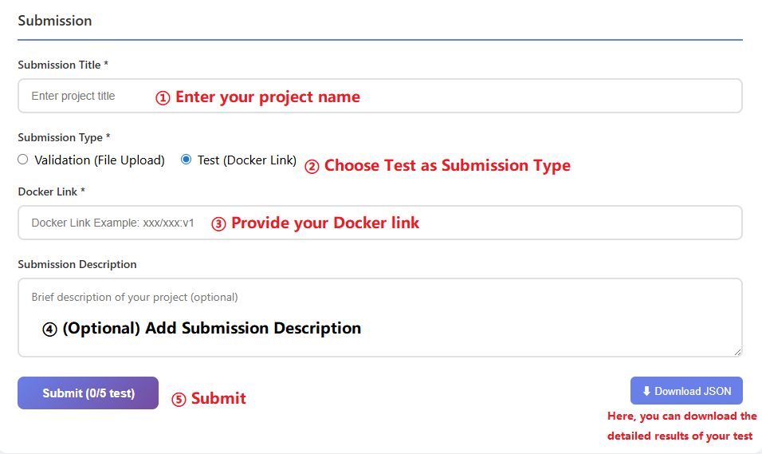

# FETUS 2026 Docker Submission Template

[](http://119.29.231.17:90/index.html)
[](https://www.docker.com/)
[](https://pytorch.org/)
[](https://developer.nvidia.com/cuda-toolkit)
[](./LICENSE)

---

## 📖 Introduction

This repository provides the **official Docker submission template** for the **FETUS 2026: Fetal HearT UltraSound Segmentation and Diagnosis Challenge**.

This template is **used exclusively for the final testing and submission stage**. Participants are required to package their trained models into a Docker image that follows a **fixed interface and I/O contract**. The evaluation system will pull and execute the submitted image directly.

> **Key principle**: The inference interface and I/O contract are fixed. Participants must integrate **their own model and weights** while ensuring that the input and output formats remain strictly unchanged.

---

## 🧭 Overview: End-to-End Submission Process

Before starting the submission steps below, participants must ensure that
the required environment is properly set up (Docker and, if applicable, GPU support). 
After confirming the environment, the complete submission process consists of the following **core steps**:

1. **Clone the submission template**
2. **Required customization** (replace model and weights)
3. **Build Docker image**
4. **Local Docker testing** using provided example data
5. **Push Docker image** to a container registry
6. **Submit Docker image URL** to the challenge platform

Each step is described in detail below and must be completed **in order**.

---

## 🛠️ Environment Setup (Prerequisite)

Docker is **mandatory** for all FETUS 2026 submissions in the final testing stage. Please ensure your environment is correctly configured **before proceeding**.

### System Requirements

- **Docker Engine**: 20.10 or newer
- **GPU Support**: NVIDIA GPU with NVIDIA Container Toolkit
- **CUDA**: 11.8 or newer (must be compatible with your chosen base image)

### Official Installation Guides (Strongly Recommended)

Please follow the **official Docker documentation** for installation:

- Docker Engine (Linux): https://docs.docker.com/engine/install/
- Docker Desktop (Windows): https://docs.docker.com/desktop/setup/install/windows-install/
- Docker Desktop (macOS): https://docs.docker.com/desktop/setup/install/mac-install/

For GPU support (Linux):

- NVIDIA Container Toolkit: https://docs.nvidia.com/datacenter/cloud-native/container-toolkit/install-guide.html

### Verify Installation

```bash
# Verify Docker
docker --version

# Verify GPU support
docker run --rm --gpus all nvidia/cuda:12.1-base-ubuntu22.04 nvidia-smi
```

---

## 🚀 Step 1: Clone the Submission Template
Clone the official FETUS 2026 Docker submission template repository and enter the project directory:
```bash
git clone https://github.com/Cola-shao/Docker_template.git
cd Docker_template
```

## 🔧 Step 2: Required Customization (Model & Weights)

⚠️ **This step is essential for all participants.**  
You must replace the model implementation and provide your own trained weights. Submissions that do not modify this step will be considered **invalid**.

### 2.1 Choose an Appropriate Base Image

Edit the first line of `Dockerfile` to select a base image compatible with your training environment:

```dockerfile
# Default
FROM pytorch/pytorch:2.5.1-cuda12.1-cudnn9-runtime

# Examples
# FROM pytorch/pytorch:2.4.0-cuda11.8-cudnn9-runtime
# FROM nvidia/pytorch:24.02-py3
```

> The base image **must match** your model's CUDA and PyTorch requirements.

---

### 2.2 Update Python Dependencies

Edit `requirements.txt` to include all dependencies required by your model:

```txt
monai==1.5.1
scipy==1.15.3
scikit-learn==1.7.2
h5py==3.15.1
tensorboard==2.20.0
einops==0.8.1
numpy==1.26.4
# Add additional dependencies below
```

---

### 2.3 Integrate Your Project

#### Step 1: Replace fiels with your own project.

#### Step 2: Place Model Weights

Copy your trained weights to the `checkpoints/` directory:

```
# Method 1: Use default path
cp your_best_model.pth checkpoints/best.pth

# Method 2: Mount external weights at runtime
docker run ... -e MODEL_PATH=/path/to/weights.pth ...
```

### 🪧 Notice

1).  Except for the Dockerfile, all other contents may be modified.  

2).  Within the Dockerfile, participants are only permitted to modify `the default command`; no other content may be altered. 

```
Dockerfile

...
...

# the defualt command  "inference.py" denotes the Python file that is actually executed during runtime.
CMD ["python", "inference.py"]

If you choose to use your own inference code, please ensure that the input and output formats remain unchanged; otherwise, the execution may fail.
```

3).  When modifying  `the default command`, the specified Python file must be the main program used for final inference.

4).  There is no need to include the data directory in the Docker image; only the source code required for inference should be provided.

---

## 🐳 Step 3: Build Docker Image

Build your submission image locally:

```bash
docker build -t <username>/fetus2026_<teamname>_submission:latest .
```

> **Recommendation**: Use explicit version tags (e.g., `v1.0`, `final`).

---

## ▶️ Step 4: Local Docker Testing (Required)

Before submission, you **must** test your image locally using the example data provided by the organizers.

```bash
docker run --rm --gpus all \
  -u $(id -u):$(id -g) \
  -v /path/to/sample_data:/data \
  -v /path/to/output:/output \
  <username>/fetus2026_<teamname>_submission:latest
```

Verify that:

- The container exits without error

-  After running, check that prediction files (`*.h5`) are generated in `/path/to/output`. Each `.h5` file should contain:

  - `mask`        np.ndarray,   # (512, 512) uint8 segmentation mask (0-14 classes)

  - `label`      np.ndarray   # (7,) uint8 binary classification labels

    ⚠️ **Key names, data types, and file naming must not be changed**, otherwise evaluation will fail.

---

## 📦 Step 5: Push Docker Image to Registry

Login to your registry (example: Docker Hub):

```bash
docker login
```

Push the image:

```bash
docker push <username>/fetus2026_<teamname>_submission:latest
```

> **Important**: Submitted images must be **publicly accessible** unless the organizers explicitly provide authentication support.

---

## 📤 Step 6: Submit Docker Image URL (Final Step)

After successfully pushing your Docker image, submit the image URL to the [FETUS 2026 Challenge Platform](http://119.29.231.17:9000/login):

**Step 6.1 – Select Submission Type**

- Choose **`Test (Docker Link)`**
- Do **not** select `Validation (File Upload)` for Docker-based submissions

**Step 6.2 – Enter Submission Title**

- Provide a descriptive title for your submission

**Step 6.3 – Provide Docker Image Link**
- Enter the full Docker image reference you pushed to the registry

**Step 6.4 – (Optional) Submission Description**
- You may include brief notes such as model architecture or training strategy
- This field is optional and does not affect evaluation

**Step 6.5 – Submit**
- Review all fields carefully and click **Submit**
- After submission:
  - ❌ Do not modify or delete the image
  - 📥 The evaluation system will pull and evaluate the image automatically

<p align="center">
  
</p>

---

## 📋 Complete Submission Workflow

```
Step 1  Environment Setup
Step 2  Mandatory Model Integration
Step 3  Build Docker Image
Step 4  Local Testing
Step 5  Push Image
Step 6  Submit Image URL
```

---

## 📄 License

This template is provided for **research and challenge submission purposes**. Participants may modify the model implementation while keeping the inference interface intact.

---

## ❓ FAQ

**Q: Can I modify `inference.py`?**  
A: Yes. Participants may modify `inference.py` **provided that the input and output formats remain unchanged** and fully compatible with the evaluation system.  
Please note that all computation inside `inference.py` is included in runtime evaluation. Avoid unnecessary post-processing or excessive overhead.

**Q: Can I use a private registry?**  
A: Only if the organizers explicitly support authenticated pulls. Public images are strongly recommended.

**Q: What if my image uses ARM architecture?**  
A: The evaluation servers run on `linux/amd64`. Ensure your image is compatible.

